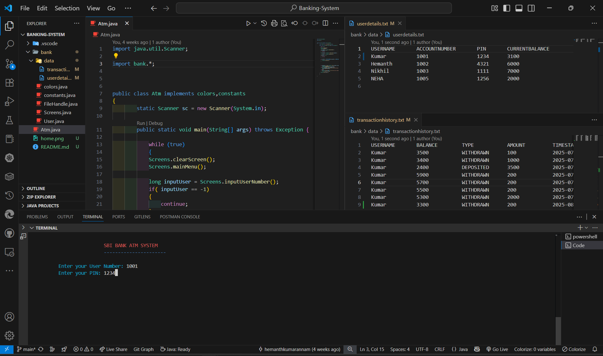
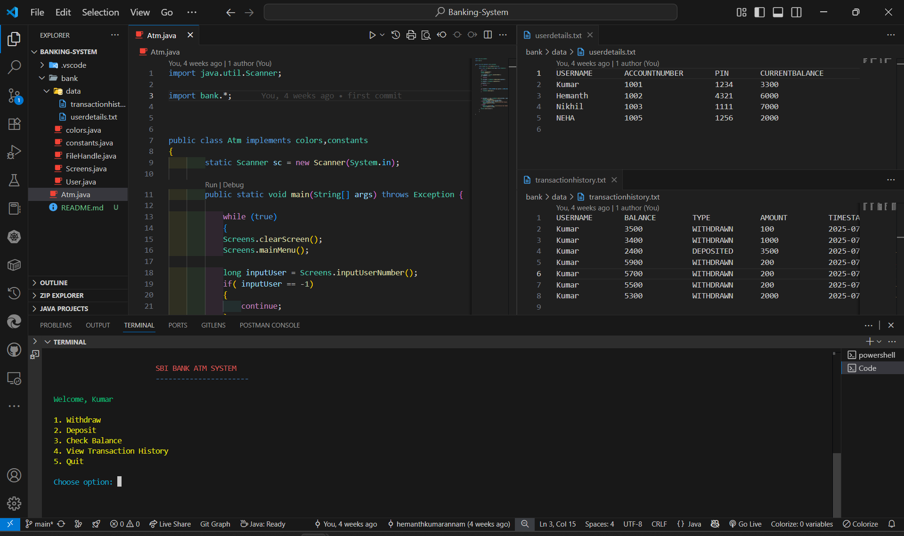

# Java Banking System

A console-based banking application built with Java that handles user accounts and transactions using file-based storage.


- User Authentication (Login/Register)
- Account Management
  - Check balance
  - View account details
  - Update personal information
- Transaction Management
  - Deposit money
  - Withdraw money
  - View transaction history
- Secure file-based data storage

## Technologies Used

- **Core**: Java 8+
- **File Handling**: Java I/O
- **Data Storage**: Text files (`userdetails.txt`, `transactionhistory.txt`)

## Prerequisites

- Java Development Kit (JDK) 8 or higher
- A Java IDE (Eclipse, IntelliJ IDEA, or VS Code with Java extensions)

## Project Structure

```
Banking-System/
├── Atm.java                # Main application class
├── bank/
│   ├── FileHandle.java     # Handles file operations
│   ├── Screens.java        # UI screens and navigation
│   ├── User.java           # User model class
│   ├── colors.java         # Console color utilities
│   └── constants.java      # Application constants
├── data/
│   ├── userdetails.txt     # Stores user account information
│   └── transactionhistory.txt  # Stores transaction records
└── README.md               # This documentation
```

## Screenshots

### Login Screen

*Figure 1: User Login*

### Dashboard

*Figure 2: User Dashboard*


## How to Run

1. Compile all Java files:
   ```bash
   javac Atm.java
   ```

2. Run the application:
   ```bash
   java Atm
   ```

3. Follow the on-screen instructions to use the banking system.

## Data Storage

The application uses two main text files for data persistence:
- `data/userdetails.txt`: Stores user account information
- `data/transactionhistory.txt`: Records all transactions

Make sure the `data` directory exists in the project root before running the application.


